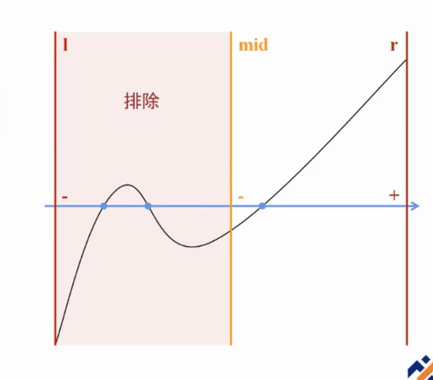
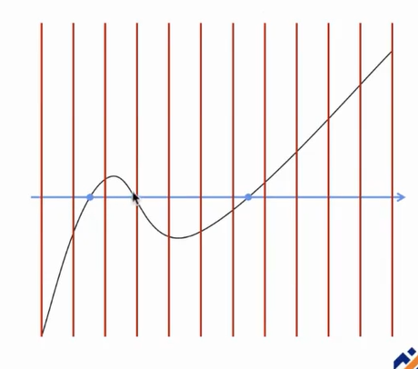
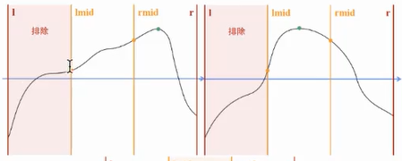

# 二分

- [二分](#二分)
  - [应用](#应用)
    - [二分答案](#二分答案)
    - [实数二分](#实数二分)
      - [寻找函数零点](#寻找函数零点)
      - [0/1分数规划](#01分数规划)
      - [最小比值生成树](#最小比值生成树)
    - [二分延伸-实数三分](#二分延伸-实数三分)
      - [求连续函数的极值点](#求连续函数的极值点)
  - [优化](#优化)
  - [模板代码](#模板代码)
    - [二分答案代码](#二分答案代码)
    - [实数二分代码](#实数二分代码)
    - [实数三分代码](#实数三分代码)
  - [例题](#例题)
    - [CF1355E Restorer Distance](#cf1355e-restorer-distance)
      - [题意](#题意)
      - [题解](#题解)
        - [参考代码](#参考代码)

## 应用

### 二分答案

[代码](#二分答案代码)

### 实数二分

[代码](#实数二分代码)

#### 寻找函数零点



单个：一次实数二分



多个：分割成段，多次二分

#### 0/1分数规划

给定等长数列 $a_i$, $b_i$, 求同样等长的数列 $w_i (w_i \in{0,1})$ , 最大化（或最小化） $\frac{\sum_i w_ia_i}{\sum_i w_ib_i}$。

考虑二分 $\frac{\sum_i w_ia_i}{\sum_i w_ib_i}$ 的最大值，在每一次二分中，相当于是验证 $\max{\frac{\sum_i w_ia_i}{\sum_i w_ib_i} \ge mid}$ 是否成立。

经过化简，每次二分的 $check$ 则变为了判断是否存在一组 $w_i$ 使 $\sum_iw_i(a_i-mid\times{b_i})\ge0$

#### 最小比值生成树

在一张无向连通图中，边具有 $a_i,b_i$ 两个权值，最小比值生成树是使 $\frac{\sum{a[i]}}{\sum{b[i]}}$ 最小的生成树

考虑用 $w_i (w_i\in{0, 1})$ 表示每条边是否选入树中，则该问题可转换为[01 分数规划问题](#01分数规划)

所以，我们令树上每一条边的边权为 $c_i(c_i=a_i-mid\times{b_i})$，然后便可转换为朴素最小生成树问题

### 二分延伸-实数三分

#### 求连续函数的极值点

要求：单峰或单谷函数，峰的两侧必须是单调增或单调减

若不满足：切片后多次三分

过程：以单峰函数为例，设当前范围为 $[l, r]$，则取其三等分点 $lmid, rmid$，判断 $f(lmid)$ 与 $f(rmid)$ 的大小关系。

若 $f(rmid) > f(lmid)$ 则可以排除 $[l, lmid]$ 部分。

特别地，若 $f(rmid) = f(lmid)$，缩小范围可以直接缩减到 $[lmid, rmid]$ 范围（但是为了代码简洁，一般直接分到大于或小于部分，反正对时间复杂度影响不大:D）。



[代码](#实数三分代码)

## 优化

在二分与三分中，每次均取的是等分点，而实际上，不取等分点也可以进行二分或三分。

在二分中，假设每次取偏左的点，则如果搜索值在左边，就可大大缩减搜索量。但是如果搜索值在右边，则每次排除的区间就大大减少了。所以在二分中，一般取最中间的点。

而在三分中，如果让 $lmid$ 与 $rmid$ 尽量靠近，比如取 $lmid=\frac{50l+49r}{99}, rmid=\frac{49l+50r}{99}$，就可以将时间复杂度从 $O(log_{\frac{3}{2}})$ 优化到 $O(log_{\frac{99}{49}})$。

理论上，在[实数三分](#二分延伸-实数三分)中， $lmid, rmid$ 可以无限接近，但是要注意精度。

## 模板代码

### 二分答案代码

```cpp
// 二分答案
int l = 0, r = n;
while (l <= r)
{
    int mid = l + r >> 1;
    if (check(mid))
        l = mid + 1;
    else
        r = mid - 1;
}
return l;
```

### 实数二分代码

```cpp
// 实数二分
double l = 0, r = n;
while (r - l > eps)
{
    double mid = (l + r) / 2;
    if (check(mid))
        l = mid;
    else
        r = mid;
}
```

### 实数三分代码

```cpp
double l = L, r = R;
for (int i = 0; i < 100; ++i)
{
    double lmid = l + (r - l) / 3, rmid = r - (r - l) / 3;
    if (f(lmid) < f(rmid))
        l = lmid;
    else
        r = rmid;
}
double top = f(l);
```

## 例题

### CF1355E Restorer Distance

#### 题意

给定 $n$ 个墙的高度，你可以执行以下操作：

- 花费 $A$ 的代价往某列加入一个砖块
- 花费 $R$ 的代价往某列去除一个砖块
- 话费 $M$ 的代价往从某列拿出一个砖块放到另一列

求需要多少钱使每一列高度相等

#### 题解

考虑固定最后每列砖块数量 $H$。

记 $P=\sum_imax\{H - h_i, 0\}, Q=\sum_imax\{h_i - H, 0\}$

判断 $M$ 和 $A + R$ 的数量关系，若 $M \lt A + R$，则执行 $min(P, Q)$ 次操作三，$abs(P - Q)$ 次操作一或二。

则此时的总代价为

$\left\{
    \begin{aligned}
    &AP + (M - A)Q &(P \ge Q)\\
    &(M - R)P + RQ &(P \lt Q)
    \end{aligned}
\right.
\ (M=min\{M, A + R\})
$

此时考虑用 $f(H)$ 表示高度为 $H$ 时的总代价，则 $f$ 为一个下凸函数。

三分 $f$ 寻找其最小值即可。

##### 参考代码

```cpp
#include <bits/stdc++.h>
#define int long long
using namespace std;
int N, A, R, M;
const int maxN = 1e5 + 5;
int h[maxN], cxy[maxN];
int calc(int H)
{
    int p = upper_bound(h + 1, h + N + 1, H) - h - 1, X = p * H - cxy[p], Y = (cxy[N] - cxy[p]) - (N - p) * H, c = min(X, Y);
    return A * (X - c) + R * (Y - c) + M * c;
}
bool check(int lmid, int rmid) { return calc(lmid) < calc(rmid); }
signed main()
{
#ifndef ONLINE_JUDGE
    freopen("3.in", "r", stdin);
#endif
    scanf("%lld%lld%lld%lld", &N, &A, &R, &M);
    M = min(M, A + R);
    for (int i = 1; i <= N; ++i)
        scanf("%lld", &h[i]);
    sort(h + 1, h + N + 1);
    for (int i = 1; i <= N; ++i)
        cxy[i] = cxy[i - 1] + h[i];
    int l = h[1], r = h[N];
    while (l < r)
    {
        int lmid = l + (r - l) / 3, rmid = r - (r - l) / 3;
        if (check(lmid, rmid))
            r = rmid - 1;
        else
            l = lmid + 1;
    }
    printf("%lld\n", calc(l));
    return 0;
}
```
