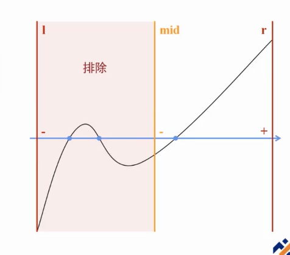
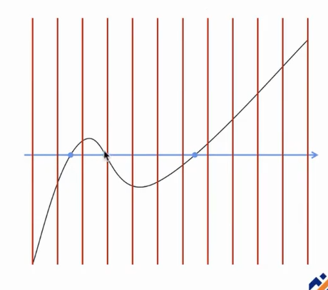

# 二分与分治

- [二分与分治](#二分与分治)
  - [应用](#应用)
    - [二分答案](#二分答案)
    - [实数二分](#实数二分)
      - [寻找函数零点](#寻找函数零点)
      - [0/1分数规划](#01分数规划)
      - [最小比值生成树](#最小比值生成树)
  - [模板代码](#模板代码)
    - [二分答案](#二分答案-1)
    - [实数二分](#实数二分-1)

## 应用

### 二分答案

[代码](#二分答案)

### 实数二分

[代码](#实数二分)

#### 寻找函数零点



单个：一次实数二分



多个：分割成段，多次二分

#### 0/1分数规划

给定等长数列 $a_i$, $b_i$, 求同样登场的数列 $w_i (w_i \in{0,1})$, 最大化（或最小化）$\frac{\sum_i w_i·a_i}{\sum_i w_i·b_i}$。

考虑二分 $\frac{\sum_i w_i·a_i}{\sum_i w_i·b_i}$ 的最大值，在每一次二分中，相当于是验证 $\max{\frac{\sum_i w_i·a_i}{\sum_i w_i·b_i} \ge mid}$ 是否成立。

经过化简，每次二分的 $check$ 则变为了判断是否存在一组 $w_i$ 使 $\sum_iw_i(a_i-mid\times{b_i})\ge0$

#### 最小比值生成树

## 模板代码

### 二分答案

```cpp
// 二分答案
int l = 0, r = n;
while (l <= r)
{
    int mid = l + r >> 1;
    if (check(mid))
        l = mid + 1;
    else
        r = mid - 1;
}
return l;
```

### 实数二分

```cpp
// 实数二分
double l = 0, r = n;
while (r - l > eps)
{
    double mid = (l + r) / 2;
    if (check(mid))
        l = mid;
    else
        r = mid;
}
```
