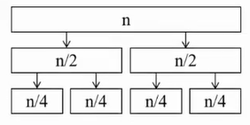

# 分治

- [分治](#分治)
  - [概括](#概括)
  - [应用](#应用)
    - [逆序对](#逆序对)
  - [例题](#例题)
    - [CF436D Pudding Monsters](#cf436d-pudding-monsters)
      - [题意简化](#题意简化)
      - [题解](#题解)

## 概括

如图

## 应用

### 逆序对

考虑分治 $[l,mid]$ 与 $[mid+1,r]$ 中的逆序对，再考虑跨越 $mid$ 的逆序对。

## 例题

### CF436D Pudding Monsters

#### 题意简化

在 $n \times n$ 的棋盘上有几枚棋子，其中第之枚棋子位于第i行第y列，保证每行每列恰有一枚棋子。现在你打算制作一个大小为k的正方形外框(k由你在1~n的整数中指定)并框住 $k \times k$ 的子棋盘，使得其内共含枚棋子。求有多少种框法。

#### 题解

记 $a_i$ 表示第 $i$ 行棋子所在的列。

所以 $a_{1...n}$ 形成长度为 $n$ 的排列

考虑第 $i$ 行到第 $j$ 行的框法

$max\{a_i, .., a_j\}-min\{a_i, .., a_j\} = i-j$，否则无法框全。

于是问题从二位降至一位，即统计排列 $a$ 中有多少满足上式的 $[i, j]$ 子段。
