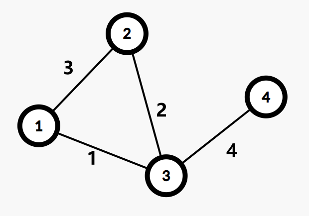
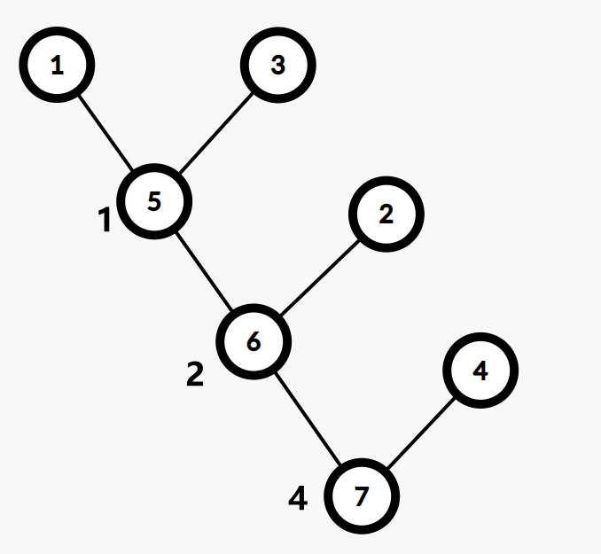

# 最小生成树

## 目录

- [最小生成树](#最小生成树)
  - [目录](#目录)
  - [定义](#定义)
  - [算法](#算法)
    - [Kruskal 算法](#kruskal-算法)
      - [Kruskal部分代码](#kruskal部分代码)
    - [Prim 算法](#prim-算法)
      - [Prim代码（来自OI Wiki）](#prim代码来自oi-wiki)
    - [Boruvka 算法](#boruvka-算法)
      - [Boruvka伪代码](#boruvka伪代码)
  - [延伸](#延伸)
    - [延伸：次小生成树](#延伸次小生成树)
      - [非严格次小生成树](#非严格次小生成树)
        - [非严格次小生成树求法](#非严格次小生成树求法)
      - [严格次小生成树](#严格次小生成树)
        - [严格次小生成树求法](#严格次小生成树求法)
    - [延伸：瓶颈生成树](#延伸瓶颈生成树)
      - [瓶颈生成树性质](#瓶颈生成树性质)
    - [延伸：Kruskal 重构树](#延伸kruskal-重构树)
      - [Kruskal重构树性质](#kruskal重构树性质)
  - [例题](#例题)
    - [CF609E Minimum spanning tree for each edge](#cf609e-minimum-spanning-tree-for-each-edge)
      - [CF609E题意](#cf609e题意)
      - [CF609E题解](#cf609e题解)
      - [CF609E代码](#cf609e代码)
    - [AT\_abc282\_e Choose Two and Eat One](#at_abc282_e-choose-two-and-eat-one)
      - [AT\_abc282\_e题意](#at_abc282_e题意)
      - [AT\_abc282\_e题解](#at_abc282_e题解)
      - [AT\_abc282\_e代码](#at_abc282_e代码)
    - [CF1857G Counting Graphs](#cf1857g-counting-graphs)
      - [CF1857G题意](#cf1857g题意)
      - [CF1857G题解](#cf1857g题解)
      - [CF1857G代码](#cf1857g代码)
    - [P4768 归程](#p4768-归程)
      - [P4768题意](#p4768题意)
      - [P4768题解](#p4768题解)
    - [CF1706E Qpwoeirut and Vertices](#cf1706e-qpwoeirut-and-vertices)
      - [CF1706E题意](#cf1706e题意)
      - [CF1706E题解](#cf1706e题解)

## 定义

定义无向连通图的**最小生成树**（Minimum Spanning Tree，MST）为边权**和**最小的生成树。

注意：只有连通图才有生成树，而对于非连通图，只存在生成森林。任意生成树本身也是生成森林

## 算法

### Kruskal 算法

Kruskal 算法是一种常见并且好写的最小生成树算法，由 Kruskal 发明。该算法的基本思想是从小到大加入**边**。

复杂度 $O(m \log m)$，主要是排序（ $m$代表边的数量）

#### Kruskal部分代码

```cpp
vector<node> res;
sort(e.begin(), e.end());
for (auto i : e)
{
    if (fa(u) != fa(v))
    {
        merge(u, v);
        res.push_back(i);
    }
}
```

### Prim 算法

不同于Kruskal，Prim的策略类似 Dijkstra，每次寻找已经选择的点的距离最近的未选择的**点**，直到所有点都连通结束。

复杂度 $O(n + m) \log n$

#### Prim代码（来自OI Wiki）

```cpp
// 使用二叉堆优化的 Prim 算法。
#include <cstring>
#include <iostream>
#include <queue>
using namespace std;
const int N = 5050, M = 2e5 + 10;

struct E {
  int v, w, x;
} e[M * 2];

int n, m, h[N], cnte;

void adde(int u, int v, int w) { e[++cnte] = E{v, w, h[u]}, h[u] = cnte; }

struct S {
  int u, d;
};

bool operator<(const S &x, const S &y) { return x.d > y.d; }

priority_queue<S> q;
int dis[N];
bool vis[N];

int res = 0, cnt = 0;

void Prim() {
  memset(dis, 0x3f, sizeof(dis));
  dis[1] = 0;
  q.push({1, 0});
  while (!q.empty()) {
    if (cnt >= n) break;
    int u = q.top().u, d = q.top().d;
    q.pop();
    if (vis[u]) continue;
    vis[u] = 1;
    ++cnt;
    res += d;
    for (int i = h[u]; i; i = e[i].x) {
      int v = e[i].v, w = e[i].w;
      if (w < dis[v]) {
        dis[v] = w, q.push({v, w});
      }
    }
  }
}
int main() {
  cin >> n >> m;
  for (int i = 1, u, v, w; i <= m; ++i) {
    cin >> u >> v >> w, adde(u, v, w), adde(v, u, w);
  }
  Prim();
  if (cnt == n)
    cout << res;
  else
    cout << "No MST.";
  return 0;
}
```

### Boruvka 算法

这个算法是前面两种算法的结合，可以用于求解非连通图的最小生成森林

初始时，每一个边均独属于一个连通块， $E' \leftarrow \varnothing$，算法步骤如下：

1. 计算每个点分别属于哪个连通块。将每个连通块都设为「没有最小边」。
2. 遍历每条边 (u, v)，如果 u 和 v 不在同一个连通块，就用这条边的边权分别更新 u 和 v 所在连通块的最小边。
3. 如果所有连通块都没有最小边，退出程序，此时的 E' 就是原图最小生成森林的边集。否则，将每个有最小边的连通块的最小边加入 E'，返回第一步。

复杂度 $O(m \log n)$

#### Boruvka伪代码


---

## 延伸

### 延伸：次小生成树

#### 非严格次小生成树

在无向图中，边权和最小的满足边权和**大于等于**最小生成树边权和的生成树

##### 非严格次小生成树求法

- 求出无向图的最小生成树 $T$，设其权值和为 $M$
- 遍历每条未被选中的边 $e = (u, v, w)$，找到 $T$ 中 $u$ 到 $v$ 路径上边权最大的一条边 $e' = (s, t, w')$，则在 $T$ 中以 $e$ 替换 $e'$，可得一棵权值和为 $M' = M + w - w'$ 的生成树 $T'$.
- 对所有替换得到的答案 $M'$ 取最小值即可

如何求 $u, v$ 路径上的边权最大值呢？

我们可以使用倍增来维护，预处理出每个节点的 $2^i$ 级祖先及到达其 $2^i$ 级祖先路径上最大的边权，这样在倍增求 LCA 的过程中可以直接求得。

#### 严格次小生成树

在无向图中，边权和最小的满足边权和**严格大于**最小生成树边权和的生成树

##### 严格次小生成树求法

考虑刚才的非严格次小生成树求解过程，为什么求得的解是非严格的？

因为最小生成树保证生成树中 $u$ 到 $v$ 路径上的边权最大值一定**不大于**其他从 $u$ 到 $v$ 路径的边权最大值。换言之，当我们用于替换的边的权值与原生成树中被替换边的权值相等时，得到的次小生成树是非严格的。

解决的办法很自然：我们维护到 $2^i$ 级祖先路径上的最大边权的同时维护**严格次大边权**，当用于替换的边的权值与原生成树中路径最大边权相等时，我们用严格次大值来替换即可。

### 延伸：瓶颈生成树

对于一个无向图 $G$ 的所有生成树，瓶颈生成树的最大的边权值在 $G$ 的所有生成树中最小。

#### 瓶颈生成树性质

最小生成树是瓶颈生成树的**充分不必要条件**。 即最小生成树一定是瓶颈生成树，而瓶颈生成树不一定是最小生成树。

证明：可以运用反证法证明：我们设最小生成树中的最大边权为 $w$，如果最小生成树不是瓶颈生成树的话，则瓶颈生成树的所有边权都小于 $w$，我们只需删去原最小生成树中的最长边，用瓶颈生成树中的一条边来连接删去边后形成的两棵树，得到的新生成树一定比原最小生成树的权值和还要小，这样就产生了矛盾。

### 延伸：Kruskal 重构树

在跑 Kruskal 的过程中我们会从小到大加入若干条边。现在我们仍然按照这个顺序。

首先新建 $n$ 个集合，每个集合恰有一个节点，点权为 $0$。

每一次加边会合并两个集合，我们可以新建一个点，点权为加入边的边权，同时将两个集合的根节点分别设为新建点的左儿子和右儿子。然后我们将两个集合和新建点合并成一个集合。将新建点设为根。

不难发现，在进行 $n - 1$ 轮之后我们得到了一棵恰有 $n$ 个叶子节点的二叉树，同时每个非叶子节点恰好有两个儿子。这棵树就叫 Kruskal 重构树。

举例：





#### Kruskal重构树性质

1. 每个叶子代表一个节点，非叶子代表边
2. 两个叶子的 LCA 的权值就是这两个节点的瓶颈路上的最大边

---

## 例题

### [CF609E Minimum spanning tree for each edge](https://www.luogu.com.cn/problem/CF609E)

#### CF609E题意

给定一个带权且连通的无向图 $G$

对于 $G$ 中的每条边 $e$，求包含 $e$ 的所有生成树中权值和最小的那个，输出权值和。

$N, M \le 2 \times 10^5$

#### CF609E题解

首先，很容易想出的，先求任意一个MST $T$，对于已经在 $e \in T$，答案直接输出。

如果 $e \notin T$，考虑将 $T$ 中 $u$ 到 $v$ 的路径中最长的边（记作 $e'$）断开，然后连接 $u, v$，则输出 $T \cup {e} - {e'}$ 的权值和即可。

证明：

考虑一个正确但是太慢的做法：

对于每一条不在 $T$ 中的 $e$，考虑将 $u, v$ 在并查集中合并，然后再去求新的MST，设这样的最小生成树为 $T'$，可以发现 $u, v$ 之间的路径的最大的边显然 $\notin T'$，所以就相当于是将最大的边替换为 $e$

#### CF609E代码

```cpp
#include <bits/stdc++.h>
#define int long long
using namespace std;
int depth[200010], f[200020][21], vis[200010], fa[200010], cnt, head[200010];
int n, m, x, y, q, start, end;
int w[200020][21], T;
struct node1
{
    int dis, u, v, id;
#define u(x) t[i].u
#define v(x) t[i].v
#define dis(x) t[i].dis
} t[400010];
struct node2
{
    int dis, ver, nxt;
} p[400010];
int find(int x) { return (fa[x] == x) ? x : fa[x] = find(fa[x]); }
void make_tree(int u)
{
    vis[u] = 1;
    for (int j = 1; j <= 20; j++)

        f[u][j] = f[f[u][j - 1]][j - 1], w[u][j] = max(w[u][j - 1], w[f[u][j - 1]][j - 1]);
    for (int i = head[u]; i; i = p[i].nxt)
    {
        int v = p[i].ver;
        if (vis[v])
            continue;
        depth[v] = depth[u] + 1, f[v][0] = u, w[v][0] = p[i].dis;
        make_tree(v);
    }
}
int lca(int x, int y)
{
    int ans = 0;
    if (depth[x] < depth[y])
        swap(x, y);
    for (int i = 20; i >= 0; i--)
        if (depth[f[x][i]] >= depth[y])
            ans = max(ans, w[x][i]), x = f[x][i];
    if (x == y)
        return ans;
    for (int i = 20; i >= 0; i--)
        if (f[x][i] != f[y][i])
            ans = max(ans, max(w[x][i], w[y][i])), x = f[x][i], y = f[y][i];
    return max(ans, max(w[x][0], w[y][0]));
}
signed main()
{
#ifndef ONLINE_JUDGE
    freopen("1.in", "r", stdin);
#endif
    auto add_edge = [](int u, int v, int l)
    { p[++cnt].dis = l, p[cnt].nxt = head[u], p[cnt].ver = v, head[u] = cnt; };
    scanf("%lld%lld", &n, &m);
    for (int i = 1; i <= m; i++)
    {
        scanf("%lld%lld%lld", &u(i), &v(i), &dis(i));
        t[i].id = i;
    }
    sort(t + 1, t + m + 1, [](node1 a, node1 b)
         { return a.dis < b.dis; });
    for (int i = 1; i <= n; i++)
        fa[i] = i;
    for (int i = 1; i <= m; i++)
    {
        int x = u(i), y = t[i].v, fx = find(x), fy = find(y);
        if (fx != fy)
        {
            fa[fx] = fy;
            add_edge(fx, fy, dis(i)), add_edge(fy, fx, dis(i));
            T += dis(i);
        }
    }
    make_tree(1);
    int ans = 0;
    sort(t + 1, t + m + 1, [](node1 a, node1 b)
         { return a.id < b.id; });
    for (int i = 1; i <= m; i++)
    {
        ans = T + dis(i) - lca(u(i), v(i));
        printf("%lld\n", ans);
    }
    return 0;
}
```

### [AT_abc282_e Choose Two and Eat One](https://www.luogu.com.cn/problem/AT_abc282_e)

#### AT_abc282_e题意

给定 $N$ 和 $M$，有 $N$ 个球，第 $i$ 个球上的数字是 $a_i$。进行以下操作 $n-1$ 次：

- 选中两个不同的球，获得 $(a_i^{a_j} + a_j^{a_i}) \bmod m$ 的分数，并且选中其中一个球扔掉

求最后的最大分数和

$N \le 500, 1 \le a_i \lt m, 2 \le M \le 10^9$

#### AT_abc282_e题解

发现每次操作均不影响 $a_i, a_j$ 的权值。

考虑将所有操作 $(i, j)$ 建图，图中不会出现环。

反过来说，每一棵生成树都能对应一个操作序列（每次消去一个叶子节点）

所以，建一个带权图， $i, j$ 之间边权为 $(a_i^{a_j} + a_j^{a_i}) \bmod m$，答案即为最大生成树的权值和。

#### AT_abc282_e代码

```cpp
#include <bits/stdc++.h>
#define int long long
using namespace std;
int n, mod;
int a[505];
int fa[5000005];
int cnt = 0;
struct node
{
    int u, v, w;
    const bool operator<(const node &x) const
    {
        return w > x.w;
    }
};
int fat(int x)
{
    return fa[x] == x ? x : fa[x] = fat(fa[x]);
}
void merge(int x, int y)
{
    fa[fat(x)] = fat(y);
}
int power(int a, int b)
{
    int sum = 1;
    while (b)
    {
        if (b & 1)
            sum = sum * a % mod;
        a = a * a % mod;
        b >>= 1;
    }
    return sum % mod;
}
int pows(int i, int j)
{
    return (power(a[i], a[j]) + power(a[j], a[i])) % mod;
}
vector<node> edge;
signed main()
{
    scanf("%lld%lld", &n, &mod);
    for (int i = 1; i <= n; ++i)
        scanf("%lld", &a[i]);
    for (int i = 1; i <= n; ++i)
    {
        for (int j = 1; j < i; ++j)
        {
            edge.push_back((node){
                i,
                j,
                pows(i, j)});
            fa[cnt] = cnt;
            ++cnt;
        }
    }
    int T = 0;
    sort(edge.begin(), edge.end());
    for (node i : edge)
    {
        if (fat(i.u) != fat(i.v))
        {
            T += i.w;
            merge(i.u, i.v);
        }
    }
    printf("%lld\n", T);
    return 0;
}
```

### [CF1857G Counting Graphs](https://www.luogu.com.cn/problem/CF1857G)

#### CF1857G题意

给定一棵有边权的树 $T$ 和一个正整数 $S$

求有多少个 $(\bmod \ 998244353)$ 简单图 $G$ 满足：
    - $G$ 中的所有边的边权不超过 $S$
    - $G$ 的 MST 唯一，且恰好为 $T$

$2 \le N \le 2 \times 10^5, S \le 10^9$

#### CF1857G题解

一个非常显然的事情是：总方案数即为每条边方案数之积。

树边已经确定，考察每条非树边 $(u, v)$ 可以怎么取。给定的树 $T$ 是唯一最小生成树，这意味着非树边 $(u, v)$ 要么不存在，要么权值大于 $T$ 上 $(u, v)$ 之间任意一条边的权值。设 T 上 $(u, v)$ 间的最大边权为 $k$，则 $(u, v)$ 对答案的贡献为 $S − k + 1$。

但我们无法枚举每条非树边计算贡献，因为复杂度为 $O(n^2)$。考虑将“一类”非树边放到一起计算。

考虑 Kruskal 算法的过程，每次取出权值最小的边 $(u, v, w)$ 加入最小生成树，并将两个连通块 $B_1, B_2$ 合并。当一条边 $(u, v, w)$ 加入最小生成树时，它就是跨越两个连通块 $B_1, B_2$ 的任意一对点间的最大权值。这就意味着对于每一对 $B_1 \times B_2$ 中的点对（$\times$ 是集合直积，$(u, v)$ 除外），这条边要么不存在，要么权值大于 $w$。

我们用桶统计出对于每个 $w$，有多少条边的要求是“要么不存在，要么权值大于 $w$”，并用快速幂计算即可。

#### CF1857G代码

```cpp
#include <bits/stdc++.h>
#define int long long
using namespace std;
const int N = 2e5 + 5, mod = 998244353;
int T, n, S;
struct Edge
{
    int u, v, w;
} e[N];

int power(int x, int y)
{
    int ans = 1;
    while (y)
    {
        if (y & 1)
            ans = ans * x % mod;
        y >>= 1, x = x * x % mod;
    }
    return ans;
}

struct node
{
    int fa[N], sz[N];
    int find(int x)
    {
        return x == fa[x] ? x : fa[x] = find(fa[x]);
    }
    void merge(int x, int y)
    {
        if (find(x) == find(y))
            return;
        x = find(x), y = find(y);
        fa[x] = y, sz[y] += sz[x];
        return;
    }
} cxy;
map<int, int> cnt;

signed main()
{
#ifndef ONLINE_JUDGE
    freopen("2.in", "r", stdin);
#endif
    scanf("%lld", &T);
    while (T--)
    {
        cnt.clear();
        scanf("%lld%lld", &n, &S);
        for (int i = 1; i < n; ++i)
            scanf("%lld%lld%lld", &e[i].u, &e[i].v, &e[i].w);
        sort(e + 1, e + n, [](Edge a, Edge b)
             { return a.w < b.w; });
        for (int i = 1; i <= n; ++i)
            cxy.fa[i] = i, cxy.sz[i] = 1;
        for (int i = 1; i < n; ++i)
        {
            int u = e[i].u, v = e[i].v, w = e[i].w;
            cnt[w] += cxy.sz[cxy.find(u)] * cxy.sz[cxy.find(v)] - 1;
            cxy.merge(u, v);
        }
        int ans = 1;
        for (auto i : cnt)
        {
            if (i.second)
                ans = ans * power(S - i.first + 1, i.second) % mod;
        }
        printf("%lld\n", ans);
    }
    return 0;
}
```

### [P4768 归程](https://www.luogu.com.cn/problem/P4768)

#### P4768题意

给定一个无向图，每条边有长度以及一个海拔

有 $Q$ 次询问，每次给定起点 $v$ 以及一个限制 $p$，从 $v$ 出发，先开车到海拔 $\gt p$ 的边到某一个节点，然后步行到 $1$ 号节点，求最短步行路程。询问强制在线。

$N \le 2 \times 10^5, M, Q \le 4 \times 10^5$

#### P4768题解

考虑 Kruskal 重构树，预处理每个子树内到 $1$ 号节点的最短距离。

### [CF1706E Qpwoeirut and Vertices](https://www.luogu.com.cn/problem/CF1706E)

#### CF1706E题意

#### CF1706E题解

---
