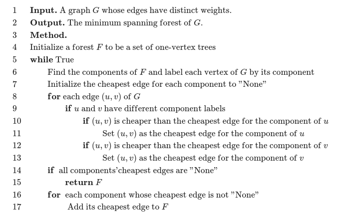

# 最小生成树

- [最小生成树](#最小生成树)
  - [定义](#定义)
  - [算法](#算法)
    - [Kruskal 算法](#kruskal-算法)
      - [Kruskal部分代码](#kruskal部分代码)
    - [Prim 算法](#prim-算法)
      - [Prim代码（来自OI Wiki）](#prim代码来自oi-wiki)
    - [Boruvka 算法](#boruvka-算法)
      - [Boruvka伪代码](#boruvka伪代码)
  - [延伸：次小生成树](#延伸次小生成树)
    - [非严格次小生成树](#非严格次小生成树)
      - [非严格次小生成树求法](#非严格次小生成树求法)
    - [严格次小生成树](#严格次小生成树)
      - [严格次小生成树求法](#严格次小生成树求法)
  - [延伸：瓶颈生成树](#延伸瓶颈生成树)
    - [瓶颈生成树性质](#瓶颈生成树性质)

## 定义

定义无向连通图的**最小生成树**（Minimum Spanning Tree，MST）为边权**和**最小的生成树。

注意：只有连通图才有生成树，而对于非连通图，只存在生成森林。任意生成树本身也是生成森林

## 算法

### Kruskal 算法

Kruskal 算法是一种常见并且好写的最小生成树算法，由 Kruskal 发明。该算法的基本思想是从小到大加入**边**。

复杂度 $O(m \log m)$，主要是排序（ $m$代表边的数量）

#### Kruskal部分代码

```cpp
vector<node> res;
sort(e.begin(), e.end());
for (auto i : e)
{
    if (fa(u) != fa(v))
    {
        merge(u, v);
        result.push_back(i);
    }
}
```

### Prim 算法

不同于Kruskal，Prim的策略类似 Dijkstra，每次寻找已经选择的点的距离最近的未选择的**点**，直到所有点都连通结束。

复杂度 $O(n + m) \log n$

#### Prim代码（来自OI Wiki）

```cpp
// 使用二叉堆优化的 Prim 算法。
#include <cstring>
#include <iostream>
#include <queue>
using namespace std;
const int N = 5050, M = 2e5 + 10;

struct E {
  int v, w, x;
} e[M * 2];

int n, m, h[N], cnte;

void adde(int u, int v, int w) { e[++cnte] = E{v, w, h[u]}, h[u] = cnte; }

struct S {
  int u, d;
};

bool operator<(const S &x, const S &y) { return x.d > y.d; }

priority_queue<S> q;
int dis[N];
bool vis[N];

int res = 0, cnt = 0;

void Prim() {
  memset(dis, 0x3f, sizeof(dis));
  dis[1] = 0;
  q.push({1, 0});
  while (!q.empty()) {
    if (cnt >= n) break;
    int u = q.top().u, d = q.top().d;
    q.pop();
    if (vis[u]) continue;
    vis[u] = 1;
    ++cnt;
    res += d;
    for (int i = h[u]; i; i = e[i].x) {
      int v = e[i].v, w = e[i].w;
      if (w < dis[v]) {
        dis[v] = w, q.push({v, w});
      }
    }
  }
}
int main() {
  cin >> n >> m;
  for (int i = 1, u, v, w; i <= m; ++i) {
    cin >> u >> v >> w, adde(u, v, w), adde(v, u, w);
  }
  Prim();
  if (cnt == n)
    cout << res;
  else
    cout << "No MST.";
  return 0;
}
```

### Boruvka 算法

这个算法是前面两种算法的结合，可以用于求解非连通图的最小生成森林

初始时，每一个边均独属于一个连通块， $E' \leftarrow \varnothing$，算法步骤如下：

1. 计算每个点分别属于哪个连通块。将每个连通块都设为「没有最小边」。
2. 遍历每条边 (u, v)，如果 u 和 v 不在同一个连通块，就用这条边的边权分别更新 u 和 v 所在连通块的最小边。
3. 如果所有连通块都没有最小边，退出程序，此时的 E' 就是原图最小生成森林的边集。否则，将每个有最小边的连通块的最小边加入 E'，返回第一步。

复杂度 $O(m \log n)$

#### Boruvka伪代码



## 延伸：次小生成树

### 非严格次小生成树

在无向图中，边权和最小的满足边权和**大于等于**最小生成树边权和的生成树

#### 非严格次小生成树求法

- 求出无向图的最小生成树 $T$，设其权值和为 $M$
- 遍历每条未被选中的边 $e = (u, v, w)$，找到 $T$ 中 $u$ 到 $v$ 路径上边权最大的一条边 $e' = (s, t, w')$，则在 $T$ 中以 $e$ 替换 $e'$，可得一棵权值和为 $M' = M + w - w'$ 的生成树 $T'$.
- 对所有替换得到的答案 $M'$ 取最小值即可

如何求 $u, v$ 路径上的边权最大值呢？

我们可以使用倍增来维护，预处理出每个节点的 $2^i$ 级祖先及到达其 $2^i$ 级祖先路径上最大的边权，这样在倍增求 LCA 的过程中可以直接求得。

### 严格次小生成树

在无向图中，边权和最小的满足边权和**严格大于**最小生成树边权和的生成树

#### 严格次小生成树求法

考虑刚才的非严格次小生成树求解过程，为什么求得的解是非严格的？

因为最小生成树保证生成树中 $u$ 到 $v$ 路径上的边权最大值一定**不大于**其他从 $u$ 到 $v$ 路径的边权最大值。换言之，当我们用于替换的边的权值与原生成树中被替换边的权值相等时，得到的次小生成树是非严格的。

解决的办法很自然：我们维护到 $2^i$ 级祖先路径上的最大边权的同时维护**严格次大边权**，当用于替换的边的权值与原生成树中路径最大边权相等时，我们用严格次大值来替换即可。

## 延伸：瓶颈生成树

对于一个无向图 $G$ 的所有生成树，瓶颈生成树的最大的边权值在 $G$ 的所有生成树中最小。

### 瓶颈生成树性质

最小生成树是瓶颈生成树的**充分不必要条件**。 即最小生成树一定是瓶颈生成树，而瓶颈生成树不一定是最小生成树。

证明：可以运用反证法证明：我们设最小生成树中的最大边权为 $w$，如果最小生成树不是瓶颈生成树的话，则瓶颈生成树的所有边权都小于 $w$，我们只需删去原最小生成树中的最长边，用瓶颈生成树中的一条边来连接删去边后形成的两棵树，得到的新生成树一定比原最小生成树的权值和还要小，这样就产生了矛盾。
