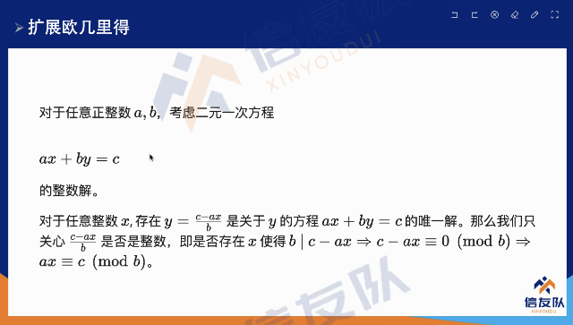
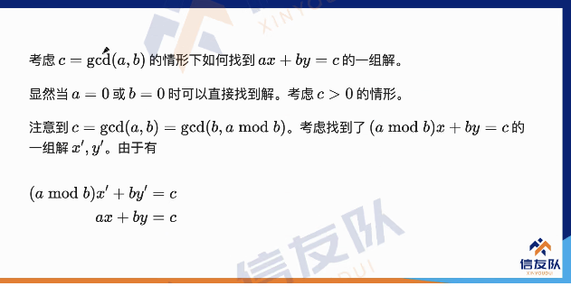
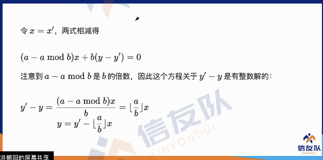
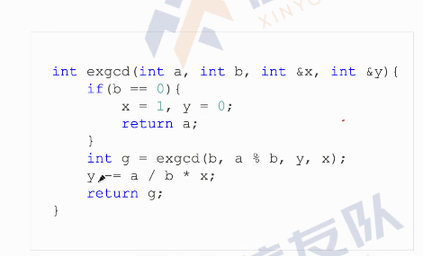
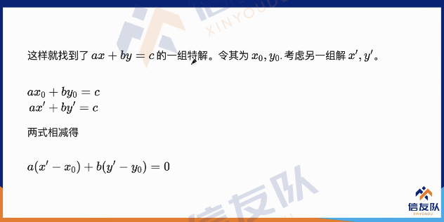
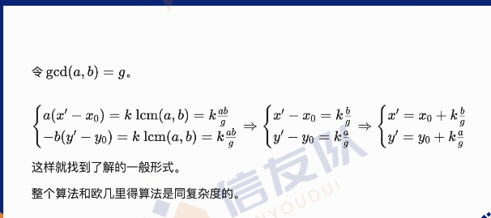

# gcd、中国剩余定理

- [gcd、中国剩余定理](#gcd中国剩余定理)
  - [gcd](#gcd)
    - [扩展欧几里得](#扩展欧几里得)

## gcd

$\gcd(a, b) = \gcd(a, a \bmod b)$

### 扩展欧几里得

时间复杂度： $O(\log(max(a, b)))$

$|x| \le |b|, |y| \le |a|$

