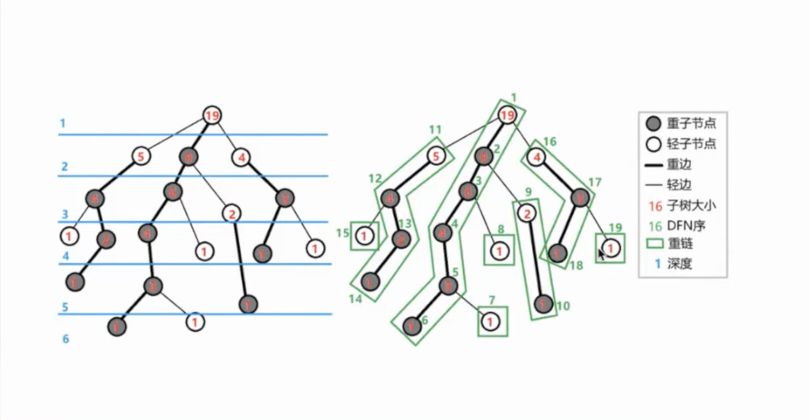

# 树链剖分

- [树链剖分](#树链剖分)
  - [概念](#概念)
  - [基本定义](#基本定义)
  - [约定定义](#约定定义)
  - [基本性质](#基本性质)
  - [例题](#例题)
    - [例题0](#例题0)
      - [例题0题意](#例题0题意)
      - [例题0题解](#例题0题解)

## 概念

树链剖分用于把一棵树分割成若干条链的形式，以维护树上路径信息。

树链剖分有多种形式，如**重链剖分**，**长链剖分**和用于Link/Cut Tree的剖分（有时又称实链剖分）。在没有特殊说明的情况下，树链剖分都指的是***重链剖分***

重链剖分可以将树上任意路径划分成 $\le O(log n)$ 条链，每条链上点的深度互不相同（即自底向上的一条链，所有点的LCA为链的一个端点）

## 基本定义

- **重子节点**表示其子节点中对打的子节点。如果有多个最大的，则任取其一。
- **轻子节点**表示除去重子节点外其他所有子节点。
- 从这个节点到重子节点的边叫做**重边**
- 到其余子节点的边叫做**轻边**
- 若干条首尾相接的重边称作**重链**
- 把最后不在重链中的节点也当作一个重链，那么整棵树便被分割为若干条重链。

整个过程可以用两次DFS完成，一边找重链，一边找落单节点

举例：

## 约定定义

- $fa(x)$ 表示 $x$ 在树上的父亲
- $dep(x)$ 表示 $x$ 在树上的深度
- $siz(x)$ 表示 $x$ 子树节点数量
- $son(x)$ 表示 $x$ 的重儿子
- $top(x)$ 表示 $x$ 所在重链的顶部（深度最小）的节点
- $dfn(x)$ 表示 $x$ 的DFS序，也是在线段树中的编号
- $rnk(x)$ 表示 DFS序所对应的节点编号，显然 $rnk(dfn(x)) = x$

在进行两次dfs时，同时也处理这些值，第一次求出 $fa, dep, siz$，第二次求出 $top, dfn, rnk$

## 基本性质

- 树上每个节点仅属于一条重链
- 重链的开头一定是轻子节点
- 在剖分的时候，因为优先遍历重边，所以树的DFS序上，重链内部的DFS序是里连续的。

## 例题

### 例题0

#### 例题0题意

给定一棵 $n$ 个点的带权树， $q$ 次询问 $u$ 到 $v$ 的最短距离。

#### 例题0题解

---待办

---
