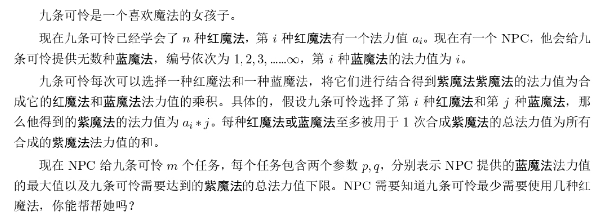
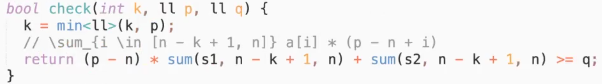

# 7/30模拟赛

- [7/30模拟赛](#730模拟赛)
  - [T1](#t1)
    - [T1题意](#t1题意)
    - [T1题解](#t1题解)
    - [T1代码](#t1代码)
  - [T2](#t2)
    - [T2题意](#t2题意)
    - [T2题解](#t2题解)
    - [T2代码](#t2代码)

## T1

### T1题意

给定一个长度为 $N$ 的序列 $a_i$ 求序列中最长的每个元素两两互不相同的区间的长度。

### T1题解

纯的双指针板子，看代码即可

### T1代码

```cpp
#include <bits/stdc++.h>
#define int long long
using namespace std;
const int N = 1e6 + 10;
int n, m = 0;
int a[N];
unordered_map<int, int> cnt;
int j = 0, ans = 0;
signed main()
{
    scanf("%lld", &n);
    for (int i = 1; i <= n; ++i)
        scanf("%lld", &a[i]);
    for (int i = 1; i <= n; ++i)
    {
        if (i > 1) // r右移
            --cnt[a[i - 1]];
        while (j < n && cnt[a[j + 1]] == 0) // l左移
            ++j, ++cnt[a[j]];
        ans = max(ans, j - i + 1);
    }
    printf("%lld\n", ans);
    return 0;
}
```

## T2

### T2题意



### T2题解

- 肯定的，对 $a$ 进行从大到小的排序
- 考虑二分 $mid$ 表示只用 $a$ 中的 $mid$ 个元素，显然是取 $a$ 和 $p$ 的最后 $mid$ 个数



### T2代码

```cpp
```
